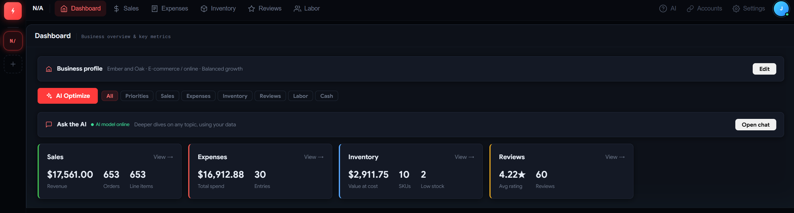
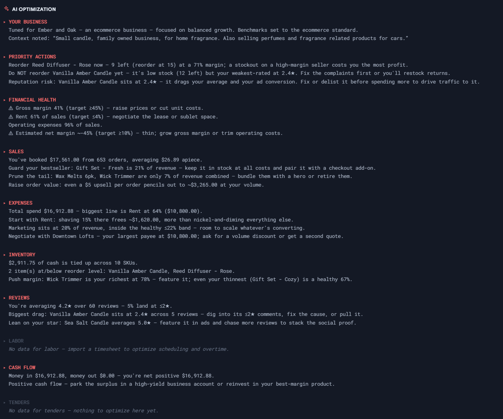
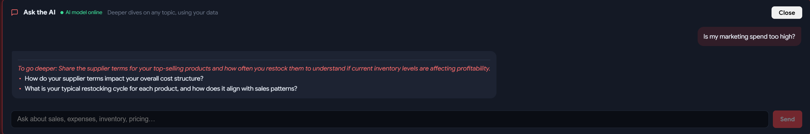
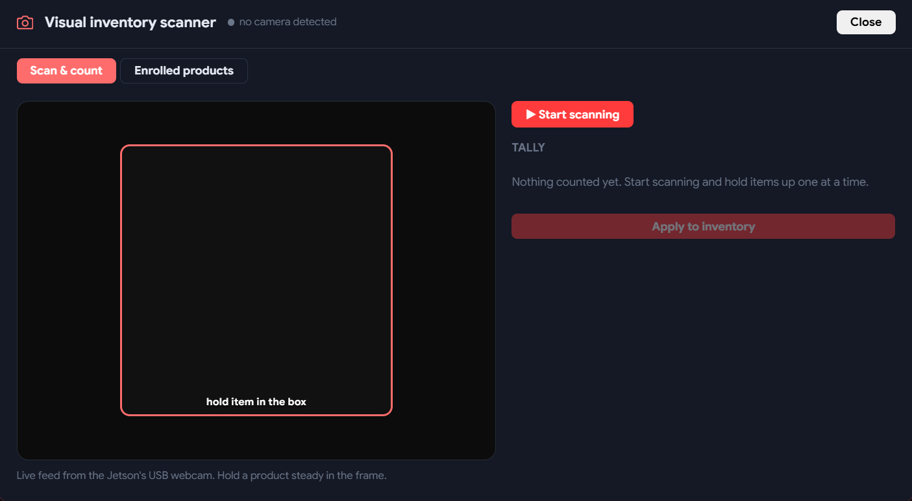
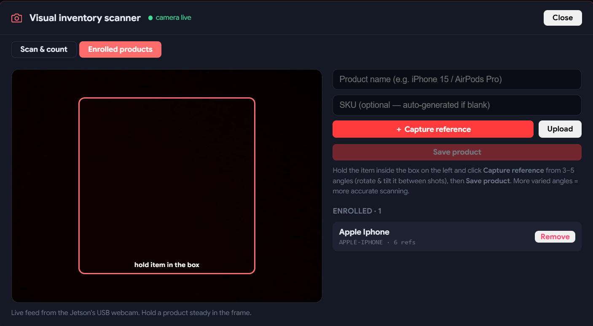

# Summit — Small-Business Operations Advisor

Summit is a local-first business analytics app for small-business owners. It ingests your
sales, expenses, labor, tenders, inventory, and reviews, then turns them into dashboards and
AI advice — a benchmarked optimizer plus a chat assistant powered by a local LLM. It also
**recognizes your products by sight**: enroll each item by photo, then hold items up to a USB
webcam and count them like a grocery-store checkout — no barcodes, no typing. The backend
is Flask, the frontend is React, and all business data (and the image recognition) stays
on-device (local SQLite); only API tokens sync to an encrypted cloud vault. The sample datasets
are synthetic, generated with the formulas below so the app is fully demoable without real data.

## Prerequisites

- Ollama — runs the local LLM (`qwen2.5:3b`) that powers the "Ask the AI" chat.
- PyTorch — GPU/ML runtime on the NVIDIA Jetson (JetPack 6, CUDA).
- ONNX Runtime — runs the DINOv2 image-embedding model (`models/dinov2_small.onnx`) for product recognition, on CPU and fully offline.
- OpenCV (`cv2`) — webcam capture and image decoding for the scanner (ships on JetPack).
- USB webcam — for live "Scan & count"; enrollment also works from uploaded photos, so a camera is optional.
- Open WebUI — optional browser UI for chatting with local models directly.
- Python 3.10+ — backend runtime.
- Node 22.12+ — only needed to rebuild the React frontend.

## Datasets — how the sample data is generated

Each dataset is synthetic and built from one simple formula, so the numbers stay realistic and
internally consistent. Every type imports as CSV/Excel; the parser auto-detects the header row
and maps columns by meaning.

- Sales & Revenue — `Revenue = Units Sold × Price per Unit`. Example: 500 units × $20 = $10,000.
- Expenses — categories: rent, utilities, marketing, software, shipping. Example: fixed rent ($5,000) + variable shipping ($2,000) = $7,000.
- Labor — `Total Labor = (Hours Worked × Hourly Wage) + Payroll Taxes`. Example: 40 hrs × $25/hr = $1,000/week per employee.
- Tenders — fields: Bid ID, Client Name, Proposed Budget, Status (Pending / Won / Lost), Submission Date.
- Inventory — `End Stock = Beginning Stock + Received − Sold`. Example: 100 + 50 − 20 = 130 items left.
- Reviews — fields: Review ID, Date, Rating (1–5 stars), Comment, Sentiment (Positive / Neutral / Negative).

## How to Run

1. Start the local LLM (Summit auto-starts it, or run it manually):
```bash
~/ollama/dist/bin/ollama serve
```
2. Start the backend:
```bash
cd ~/apps/JetCore/Summit
python3 backend.py
```
3. Open `http://localhost:5000` and sign up — accounts are local to this machine.
4. On each tab, click **Import** and upload the matching CSV/Excel file (formats above).
5. Optional — plug in a USB webcam, then open **Inventory → Scan & count** to enroll products and count them live.
6. Optional — rebuild the frontend after editing anything in `frontend/src/`:
```bash
export PATH="$HOME/.local/node-v22.14.0-linux-arm64/bin:$PATH"
cd frontend && npm install && npm run build
```

## How It Works

- Import — upload any sales / expense / labor / tender / inventory / review file; pandas + fuzzy header-matching auto-parse varied layouts. Replace or delete each dataset anytime.
- Dashboard — renders a card only for the datasets you have actually uploaded.
- AI Optimize — a benchmarked engine (labor %, gross margin, marketing ratio, review score, inventory turnover) that cross-references your data and types out prioritized, quantified actions; filter by section for a deeper dive.
- Ask the AI — a chat that answers any business question from your own numbers via the local LLM, grounded so it never invents figures, with a rule-based fallback. It stays on-topic, professional, and paraphrases itself so repeat questions never read the same twice.
- Scan & Count — recognize products by sight and count them with a webcam (see below).
- Business Profile — describe your business so the advice is tuned to your industry, goals, and margin/labor targets.
- Local-first — business data lives in local SQLite (`optiflow.db`); only integration API tokens sync to the encrypted cloud vault.

## Visual Product Recognition (Scan & Count)

Summit can identify products from a camera — no barcodes and no manual entry — and update your
inventory counts. It runs entirely on-device. Open it from **Inventory → Scan & count**.

- Enroll by photo — hold a product to the webcam (or upload photos) and capture a few reference
  shots from different angles, then save. You do this once per item; there are no SKUs to type.
- Live scan & count — the Jetson streams its webcam to the page (server-side MJPEG, so it works
  over localhost or the LAN with no browser-camera permission). Hold items up one at a time and
  Summit tallies each automatically, like a self-checkout; adjust with +/− and hit **Apply** to
  update `stock_qty`.
- How recognition works — a **DINOv2-small** ONNX model (via ONNX Runtime, CPU) turns each image
  into a 384-dim embedding; a scanned frame is matched to the nearest enrolled product by cosine
  similarity. No GPU or PyTorch is needed for this — it runs fast enough for live counting.
- Accuracy safeguards — only the region inside the on-screen **hitbox** is analyzed, so the
  product (not your hand or the background) drives the match; and a **margin gate** requires the
  top match to clearly beat the runner-up, so look-alike items are flagged as "unsure" (with a
  one-tap add) instead of being miscounted. Thresholds are tunable via `SUMMIT_MATCH_THRESHOLD`
  and `SUMMIT_MATCH_MARGIN`.

Endpoints: `POST /api/inventory/enroll/<uid>`, `GET /api/inventory/enrolled/<uid>`,
`DELETE /api/inventory/enroll/<uid>/<sku>`, `POST /api/inventory/recognize/<uid>`,
`POST /api/inventory/count/<uid>`, and the live stream at `GET /api/camera/stream`.

## Screenshots

Dashboard — top navbar, business profile, the AI Optimize bar with section filters, and a live
card for each dataset you've uploaded.



AI Optimize — benchmarked, cross-referenced recommendations typed out per section: priority
actions, financial health, and one block each for sales, expenses, inventory, reviews, and cash.



Ask the AI — a grounded chat that answers from your own numbers and ends with a targeted
"To go deeper" follow-up to sharpen the advice.



Scan & Count — the live webcam feed with the recognition hitbox on the left and the running
tally on the right; hold items up one at a time and hit Apply to update inventory.



Enroll products — capture a few reference photos of each item from different angles (or upload
them), save, and it's added to the enrolled list the scanner recognizes.



## Demonstration Video

- [Full walkthrough](https://drive.google.com/file/d/1viHK-coaKyzoB856D4_H3T9u3YSUL9mI/view?usp=sharing) — a guided tour of Summit end to end.
- [AI Optimization showcase](https://drive.google.com/file/d/1ritJP9Kef21JO2zFDh8XujiP6tEEqvNt/view?usp=sharing) — the local LLM generating live, quantified recommendations.

## Acknowledgments

- Local inference via **Ollama** and **PyTorch** on **NVIDIA Jetson** (JetPack 6, CUDA).
- Visual product recognition via **DINOv2** (Meta AI) exported to ONNX, run with **ONNX Runtime** and **OpenCV**.
- Optional local model UI via **Open WebUI**.
